#### Escuela Colombiana de Ingeniería
#### Procesos de desarrollo de software - PDSW
#### Construción de un cliente 'grueso' con un API REST, HTML5, Javascript y CSS3. Parte II.

### Integrantes
- Laura Natalia Perilla Quintero - [Lanapequin](https://github.com/Lanapequin)
- Santiago Botero Garcia - [LePeanutButter](https://github.com/LePeanutButter)


1. Agregue al canvas de la página un manejador de eventos que permita capturar los 'clicks' realizados, bien sea a través del mouse, o a través de una pantalla táctil. Para esto, tenga en cuenta [este ejemplo de uso de los eventos de tipo 'PointerEvent'](https://mobiforge.com/design-development/html5-pointer-events-api-combining-touch-mouse-and-pen) (aún no soportado por todos los navegadores) para este fin. Recuerde que a diferencia del ejemplo anterior (donde el código JS está incrustado en la vista), se espera tener la inicialización de los manejadores de eventos correctamente modularizado, tal [como se muestra en este codepen](https://codepen.io/hcadavid/pen/BwWbrw).

2. Agregue lo que haga falta en sus módulos para que cuando se capturen nuevos puntos en el canvas abierto (si no se ha seleccionado un canvas NO se debe hacer nada):
    1. Se agregue el punto al final de la secuencia de puntos del canvas actual (sólo en la memoria de la aplicación, AÚN NO EN EL API!).
    2. Se repinte el dibujo.

3. Agregue el botón Save/Update. Respetando la arquitectura de módulos actual del cliente, haga que al oprimirse el botón:
    1. Se haga PUT al API, con el plano actualizado, en su recurso REST correspondiente.
    2. Se haga GET al recurso /blueprints, para obtener de nuevo todos los planos realizados.
    3. Se calculen nuevamente los puntos totales del usuario.

   Para lo anterior tenga en cuenta:

    * jQuery no tiene funciones para peticiones PUT o DELETE, por lo que es necesario 'configurarlas' manualmente a través de su API para AJAX. Por ejemplo, para hacer una peticion PUT a un recurso /myrecurso:

   ```javascript
   return $.ajax({
       url: "/mirecurso",
       type: 'PUT',
       data: '{"prop1":1000,"prop2":"papas"}',
       contentType: "application/json"
   });
   
   ```
   Para éste note que la propiedad 'data' del objeto enviado a $.ajax debe ser un objeto jSON (en formato de texto). Si el dato que quiere enviar es un objeto JavaScript, puede convertirlo a jSON con:

   ```javascript
   JSON.stringify(objetojavascript),
   ```
    * Como en este caso se tienen tres operaciones basadas en _callbacks_, y que las mismas requieren realizarse en un orden específico, tenga en cuenta cómo usar las promesas de JavaScript [mediante alguno de los ejemplos disponibles](http://codepen.io/hcadavid/pen/jrwdgK).

4. Agregue el botón 'Create new blueprint', de manera que cuando se oprima:
    * Se borre el canvas actual.
    * Se solicite el nombre del nuevo 'blueprint' (usted decide la manera de hacerlo).

   Esta opción debe cambiar la manera como funciona la opción 'save/update', pues en este caso, al oprimirse la primera vez debe (igualmente, usando promesas):

    1. Hacer POST al recurso /blueprints, para crear el nuevo plano.
    2. Hacer GET a este mismo recurso, para actualizar el listado de planos y el puntaje del usuario.

5. Agregue el botón 'DELETE', de manera que (también con promesas):
    * Borre el canvas.
    * Haga DELETE del recurso correspondiente.
    * Haga GET de los planos ahora disponibles.

### Criterios de evaluación

1. Funcional
    * La aplicación carga y dibuja correctamente los planos.
    * La aplicación actualiza la lista de planos cuando se crea y almacena (a través del API) uno nuevo.
    * La aplicación permite modificar planos existentes.
    * La aplicación calcula correctamente los puntos totales.
2. Diseño
    * Los callback usados al momento de cargar los planos y calcular los puntos de un autor NO hace uso de ciclos, sino de operaciones map/reduce.
    * Las operaciones de actualización y borrado hacen uso de promesas para garantizar que el cálculo del puntaje se realice sólo hasta cando se hayan actualizados los datos en el backend. Si se usan callbacks anidados se evalúa como R.

**Respuestas**
1. Se creó una función llamada initCanvasEvents() que:
   - Selecciona el canvas por su ID.
   - Añade un listener para el evento pointerdown.
   - Calcula la posición del click relativo al canvas.
   - Dibuja un círculo rojo en la posición clickeada.
   - Imprime las coordenadas en la consola.

     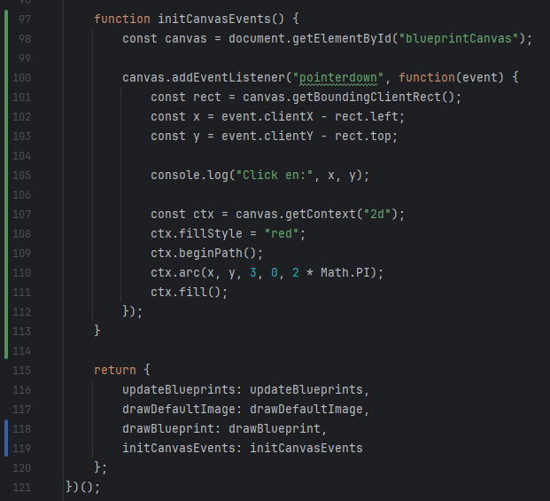

   Se aseguro que los manejadores de eventos se inicialicen correctamente al cargar la página

   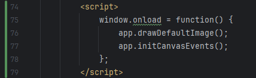

   Se probó la aplicación en el navegador, verificando que:
   - El canvas responde a los clics dibujando círculos rojos.
   - Se muestran los planos disponibles en la tabla.
   - Se registran los eventos en la consola.
   - Se observa actividad en las herramientas de desarrollo del navegador.
   
   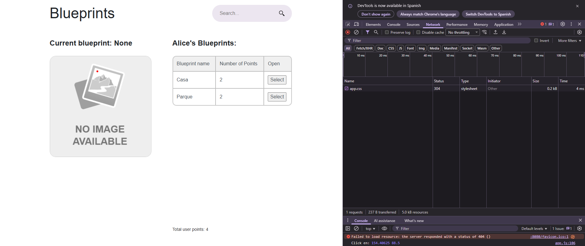

2. Se inicializa una variable que representa el blueprint actualmente seleccionado, esto garantiza que si no se ha seleccionado ningún plano, no se deben agregar puntos. 
   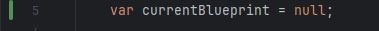

   Se modifico la función initCanvasEvents(), se creo repaintBlueprint() para borrar y redibujar el canvas con los puntos y líneas del blueprint actual y setCurrentBlueprint(blueprint) para asignar el blueprint actual y llamar a repaintBlueprint() para mostrarlo.
   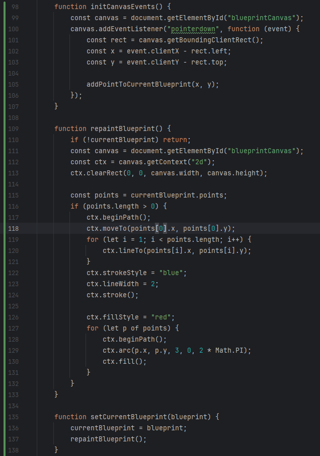

   Se configura el repintado automático al redimensionar la ventana
   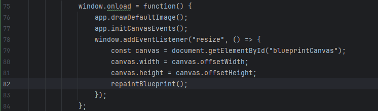

   Cuando no se ha seleccionado un plano, si se presiona en el canvas, en la consola aparece "No blueprint selected.", lo que confirma que se intentó agregar un punto pero el sistema no lo permitió, cumpliendo con la lógica pedida.
   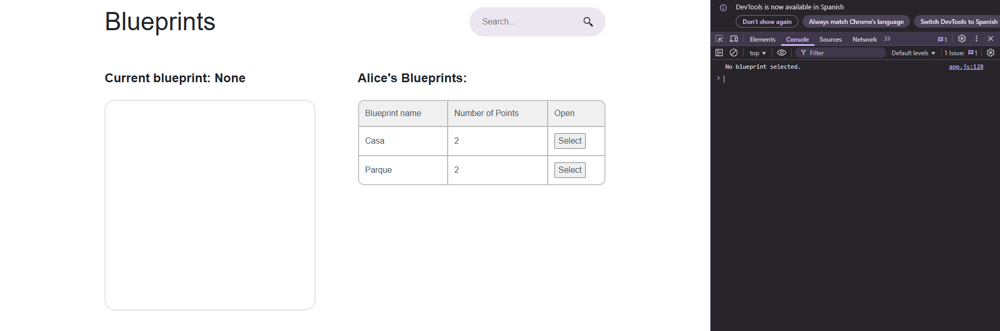

   Si el usuario ya selecciono un plano, en el canvas se ven puntos conectados por líneas, y en la consola aparece un arreglo con las coordenadas de los puntos agregados, esto demuestra que:
   - Los puntos se guardan en memoria.
   - El dibujo se repinta automáticamente.
   
   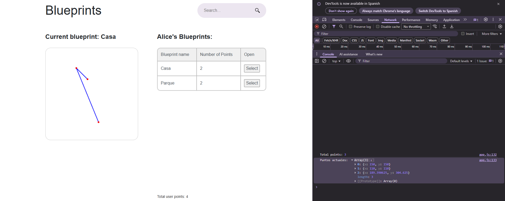

3. Se creo la funcion saveOrUpdateBlueprint(), la cual se encarga de:
   - Verificar si hay un blueprint seleccionado y si el autor está definido.
   - Crea un objeto blueprintData con el nombre del plano, el autor y los puntos actuales.
   - Realiza una petición PUT al API para actualizar el plano.
   - Luego, realiza una petición GET para obtener todos los planos del autor.
   - Finalmente, llama a updateBlueprintTable() para recalcular los puntos totales y actualizar la interfaz.

   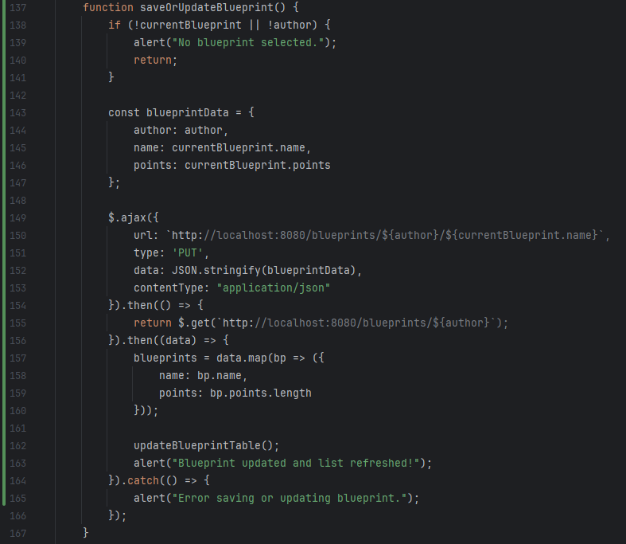

   Se creo la funcion updateBlueprintTable() con el fin de que se encargara de:
   - Vaciar el contenido actual de la tabla de planos.
   - Recorrer los planos obtenidos y agregar filas con su nombre, número de puntos y botón para abrirlos.
   - Calcular el total de puntos del usuario usando .reduce() sobre los planos.
   - Actualizar el valor en el elemento HTML con ID totalPoints.

   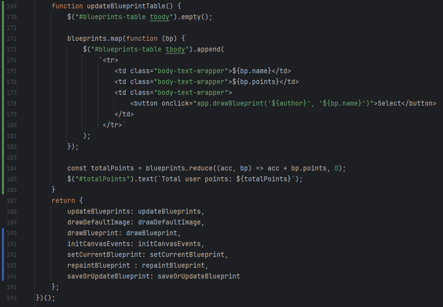

   Con la interfaz en ejecución y luego de guardar el plano, se verifico que los datos si se estan actualizando en la tabla y en el número total de puntos.
   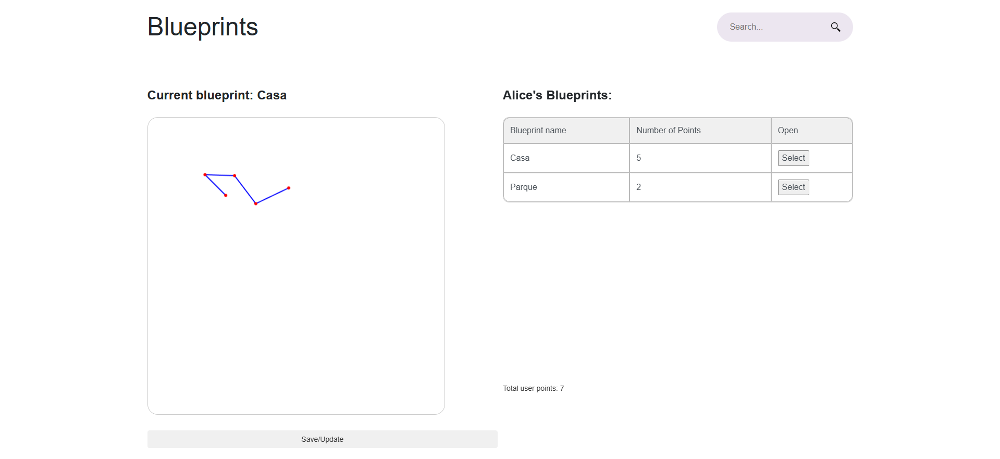

4. Se agregó el botón **Create new blueprint**, que permite al usuario crear un nuevo plano desde cero. Al hacer clic en este botón:

   - Se borra el canvas actual utilizando la función `drawDefaultImage()`.
   - Se muestra un modal emergente donde el usuario puede ingresar el nombre del nuevo blueprint.
   - Al confirmar, se construye un objeto con el nombre, autor y un arreglo vacío de puntos.
   - Se realiza una petición **POST** al recurso `/blueprints` para crear el nuevo plano en el backend.
   - Luego, se hace una petición **GET** al recurso `/blueprints/{author}` para actualizar la lista de planos y el puntaje total del usuario.
   - Finalmente, se actualiza la tabla de planos y el total de puntos usando `updateBlueprintTable()`.
    
    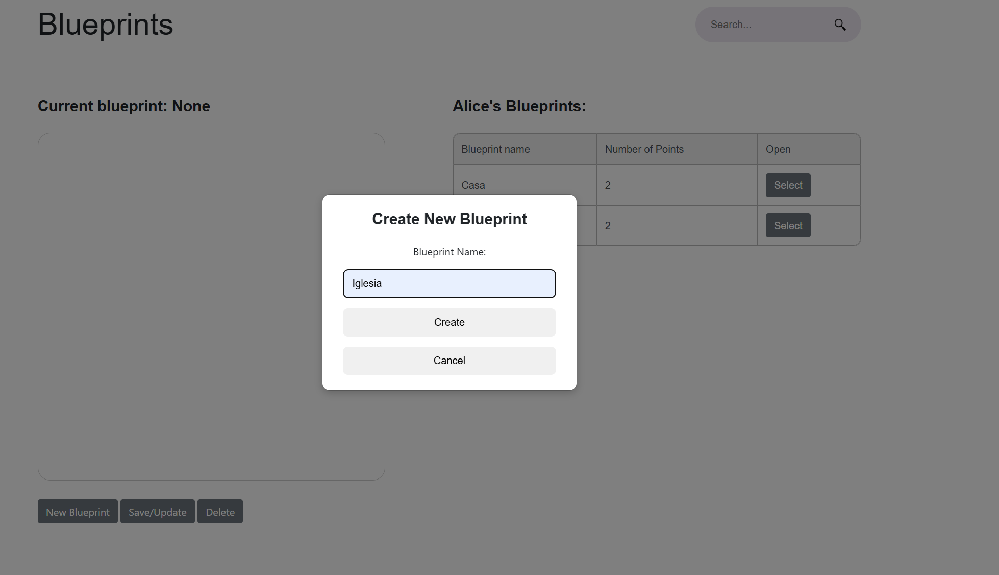

    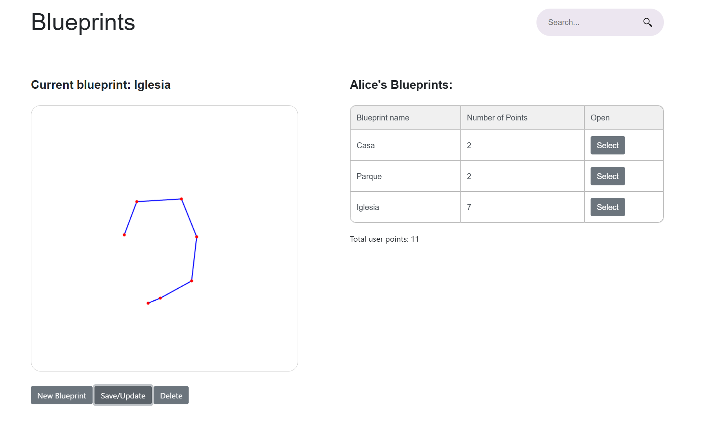

5. Se implementó el botón **DELETE**, que permite eliminar un plano existente. Al presionar este botón:

   - Se verifica que haya un blueprint seleccionado.
   - Se solicita confirmación al usuario mediante un `confirm()` para evitar eliminaciones accidentales.
   - Si el usuario confirma, se realiza una petición **DELETE** al recurso `/blueprints/{author}/{name}`.
   - Luego, se hace una petición **GET** al recurso `/blueprints/{author}` para obtener la lista actualizada de planos.
   - Se borra el canvas utilizando `drawDefaultImage()` y se actualiza la tabla de planos y el total de puntos con `updateBlueprintTable()`.

    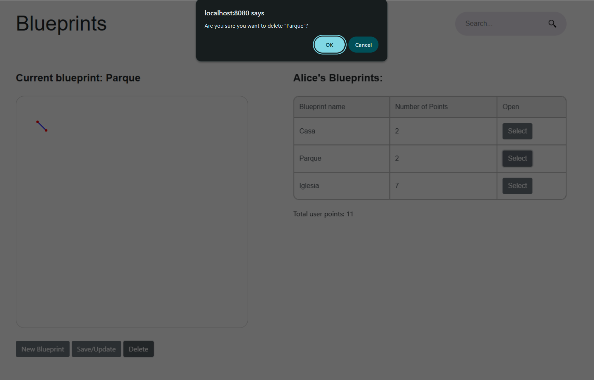

    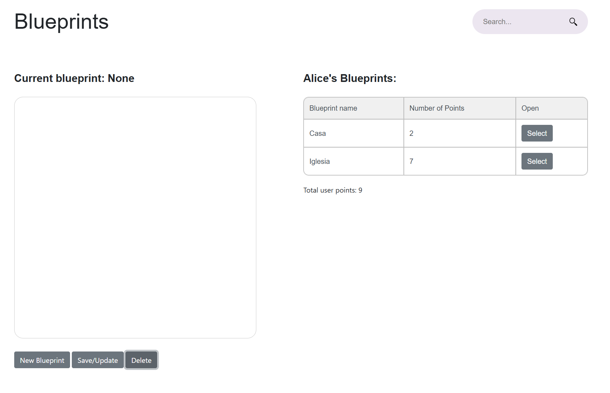